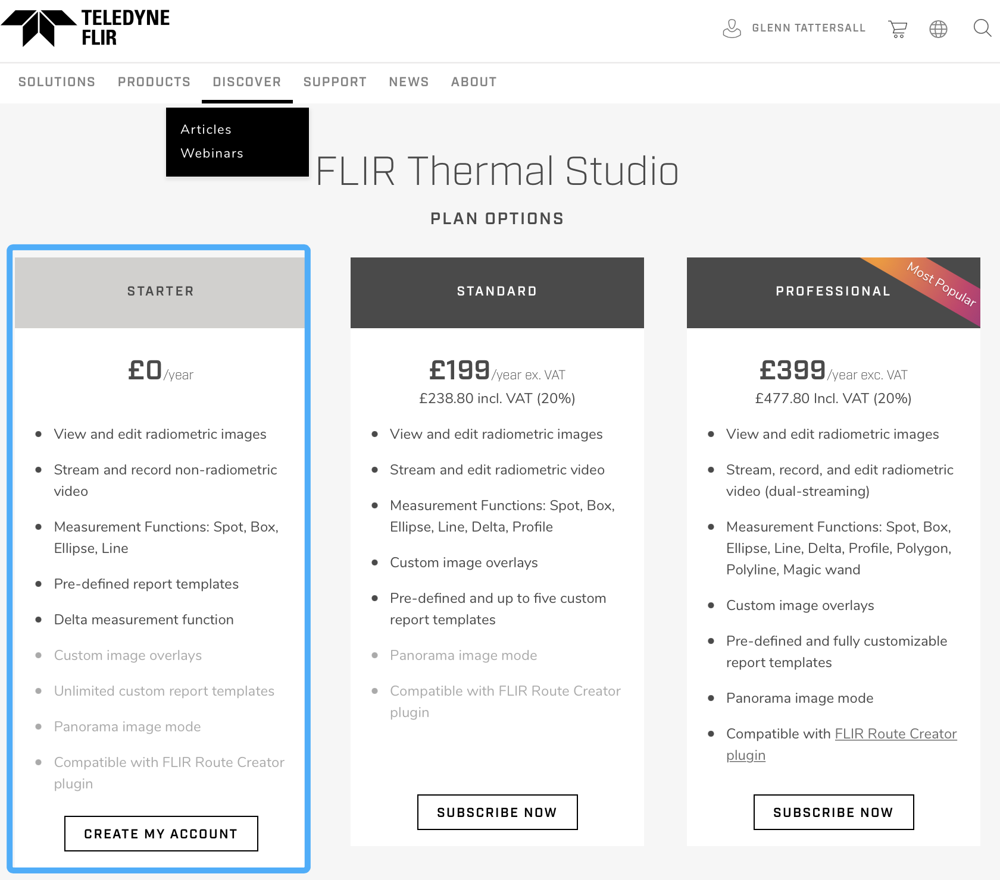

```{r setup, include=FALSE}
knitr::opts_chunk$set(echo = TRUE)
```

# Thermal Imaging Workshop

## When
- November 11, 2022

## Where
- Lund University

## Instructors
- Dr. Dominic McCafferty
= Dr. Andreas Nord
- Dr. Joshua Tabh
- Dr. Glenn Tattersall

## Schedule

- Morning: Theory and Background to Infrared Thermal Imaging and Field Thermography

- Afternoon: Break-out sessions using thermal imaging cameras, analysing thermal images and videos, common pitfalls in analysis and image capture


## Before you attend

- To participate in this workshop, you will need a functioning software solution for examining FLIR radiometric image files.

- Please download FLIR Studio Starter here (https://www.flir.co.uk/instruments/thermal-studio-plan-selection/
) and choose the free option that gives us limited access to features:


- Register with FLIR and they will send you a license key to access the free software features. 


## File Access

- During the workshop we will demonstrate functionality of analysing radiometric images by using previously collected thermal images and thermal videos.

- Please verify you can access files from the following onedrive website:
https://brocku-my.sharepoint.com/:f:/g/personal/gtattersall_brocku_ca/Ei2EJzkhlOpAumgHp_e85MkByz4xdqxjXBEa-cnQiAkfxA?e=VCJ0d6


